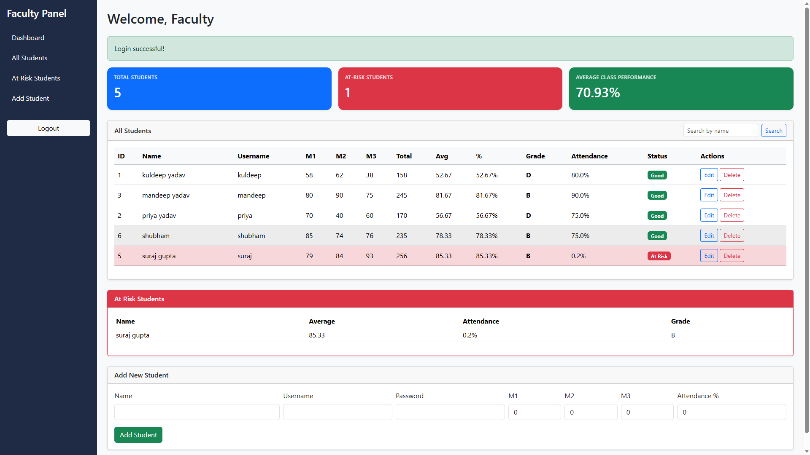

# 🎓 At-Risk Student Detection System

An interactive web-based application that helps identify students who are at academic risk based on their attendance and academic performance. The system enables faculty to monitor student progress and take timely actions to improve outcomes.

---

## 📷 Project Preview

---

## ✨ Features

- 📊 Faculty Dashboard
- 👨‍🎓 Student Management (Add, Edit & Delete)
- ⚠️ Automatic At-Risk Student Detection
- 📈 Average Class Performance
- 📋 Student Performance Records
- 🔍 Search Students by Name
- 🎯 Attendance & Marks Analysis
- 📑 Dedicated At-Risk Students Section

---

## 🛠️ Tech Stack

- Python
- Flask
- HTML
- CSS
- JavaScript
- SQLite

---

## 📂 Dataset

Custom Student Dataset

---
